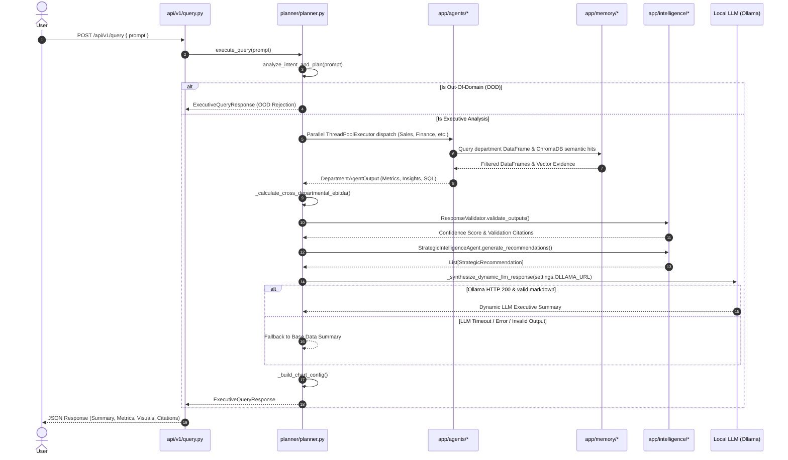

# Nexora AI — System Architecture & Developer Guide

This document provides an up-to-date architectural map of **Nexora AI** following the codebase reorganization (Refactor Phase). It serves as both a technical system specification and an educational study guide for developers exploring the platform.

---

## 1. System Overview & Core Philosophy

**Nexora AI** is an Enterprise Intelligence AI Operating System designed to deliver fast, data-grounded insights across corporate departments (Sales, Finance, HR, Marketing, Operations).

### Core Architectural Principles

1. **Data-Grounded Computation**: Statistical calculations, SQL aggregations, date filtering, and KPI extraction are strictly performed in deterministic Python code (`pandas`, `numpy`, `sqlalchemy`).
2. **LLM-Assisted Executive Synthesis**: Dynamic natural language rephrasing is handled by local open-source LLMs (Ollama Llama 3). If the LLM is unavailable or fails validation, the system gracefully falls back to structured Markdown generated from raw data evidence.
3. **Parallel Multi-Agent Dispatch**: Queries targeting multiple business units execute concurrently using thread-safe database sessions.
4. **Hybrid Enterprise Memory**: Integrates relational database storage (SQLite for instant development, PostgreSQL for production) with ChromaDB vector embeddings for semantic document search.
5. **Evidence-Grounded Response Design**: Executive responses are assembled from structured department metrics, validation results, and available evidence citations. The system is designed to reduce unsupported claims by validating agent outputs before final response assembly.

---

## 2. Backend Package Map

The backend codebase located in `backend/app/` is organized into clean, single-responsibility top-level packages:

```text
backend/app/
├── api/              # HTTP REST API layer (v1 router, auth, query, ingest, sentinel, deps)
├── agents/           # Domain intelligence agents (sales, finance, hr, marketing, operations, base)
├── planner/          # Central orchestrator (planner.py) & intent classifier
├── intelligence/     # Verification engine (validator.py) & recommendation generator (strategic.py)
├── ingestion/        # CSV DataProfiler & SchemaIntelligenceEngine mapping tool
├── memory/           # Hybrid memory manager (enterprise_memory.py - SQL + ChromaDB)
├── sentinel/         # Anomaly detection service (sentinel_service.py)
├── reporting/        # Executive PDF export engine (pdf_exporter.py)
├── core/             # Centralized settings (config.py), DB session (database.py), auth security
├── models/           # SQLAlchemy ORM models (domain.py)
├── schemas/          # Pydantic data schemas & contract definitions (agents.py, auth.py, etc.)
└── utils/           # Shared utility functions (date_filters.py)
```

---

## 3. Query Execution Lifecycle

When an executive query is submitted, it flows linearly through the system architecture:



---

## 4. Data Ingestion & Schema Intelligence Lifecycle

Dataset ingestion is divided into two distinct steps to ensure schema safety before records enter enterprise memory:

```text
Step 1: Schema Proposal
[ User CSV File ] ──► POST /api/v1/ingest/propose-schema ──► SchemaIntelligenceEngine
                                                                      │
                                                       Calculates fuzzy match scores
                                                       against canonical department schemas
                                                                      │
                                                                      ▼
                                                      Proposed Column Mappings JSON

Step 2: Confirmation & Ingestion
[ User Confirmed Mappings ] ──► POST /api/v1/ingest/confirm-and-ingest ──► DataProfiler
                                                                                │
                                                            - Standardizes column names
                                                            - Imputes missing numeric values
                                                            - Computes aggregate KPIs
                                                            - Detects time series trends
                                                                                │
                                                                                ▼
                                                            [ Enterprise Memory Indexing ]
                                                            ├── Relational Dataset Storage
                                                            └── ChromaDB Vector Indexing
```

---

## 5. Department Agent Architecture

All domain agents inherit from `BaseDepartmentAgent` ([`backend/app/agents/base.py`](file:///c:/Users/vijxi/OneDrive/Desktop/nexora_ai/nexora_ai/backend/app/agents/base.py)):

```text
                     BaseDepartmentAgent
                     (Memory query, vector search, missing dataset fallback)
                                │
       ┌────────────────────────┼────────────────────────┬────────────────────────┐
       ▼                        ▼                        ▼                        ▼
  SalesAgent               FinanceAgent               HRAgent               MarketingAgent & OperationsAgent
 (Revenue, Deals,         (Expenses, OpEx,          (Headcount,            (Ad Spend, ROAS, MQLs,
  MoM Growth)             Net Margin, MoM)           Salary, Rating)        Fulfillment Lead Times)
```

### Agent Domain Specialization

* **SalesAgent** ([`sales.py`](file:///c:/Users/vijxi/OneDrive/Desktop/nexora_ai/nexora_ai/backend/app/agents/sales.py)): Resolves revenue and date columns, applies natural language date filters (`apply_natural_language_date_filter`), calculates monthly sales MoM percentage changes, and identifies top performing account/regional categories.
* **FinanceAgent** ([`finance.py`](file:///c:/Users/vijxi/OneDrive/Desktop/nexora_ai/nexora_ai/backend/app/agents/finance.py)): Resolves expense and date columns, applies date filters, calculates monthly expense trends, and computes Net EBITDA when profit keywords are present.
* **HRAgent** ([`hr.py`](file:///c:/Users/vijxi/OneDrive/Desktop/nexora_ai/nexora_ai/backend/app/agents/hr.py)): Counts total workforce headcount, calculates compensation averages, and generates talent retention alignment guidance.
* **MarketingAgent** ([`marketing.py`](file:///c:/Users/vijxi/OneDrive/Desktop/nexora_ai/nexora_ai/backend/app/agents/marketing.py)): Uses regex word-boundary matching to identify ad spend, ROAS, and MQL lead columns, generating channel optimization recommendations.
* **OperationsAgent** ([`operations.py`](file:///c:/Users/vijxi/OneDrive/Desktop/nexora_ai/nexora_ai/backend/app/agents/operations.py)): Calculates average fulfillment delay lead times and identifies worst-performing warehouse locations for SLA renegotiation.

---

## 6. Enterprise Memory Layer

The memory layer ([`backend/app/memory/enterprise_memory.py`](file:///c:/Users/vijxi/OneDrive/Desktop/nexora_ai/nexora_ai/backend/app/memory/enterprise_memory.py)) manages dual-tier data storage:

1. **Relational Database Tier**:
   * Configured via `DATABASE_URL` in `app/core/config.py` (defaults to local SQLite `sqlite:///./nexora.db`, supports PostgreSQL in production).
   * Stores raw uploaded dataset rows, metadata, audit logs, and Sentinel alerts.
   * `query_department_dataframe(department)` converts relational table records directly into Pandas DataFrames for rapid analytical processing.

2. **Semantic Vector Tier**:
   * Powered by **ChromaDB** (persisted at `CHROMA_PERSIST_DIR`).
   * Uses Sentence-Transformers (`all-MiniLM-L6-v2`) to generate embeddings for dataset metadata, schema summaries, and metric descriptions.
   * `search_semantic_memory(prompt, department)` retrieves top-k relevant textual hits to populate evidence citations.

---

## 7. Sentinel AI Anomaly Detection Engine

[`SentinelAIService`](file:///c:/Users/vijxi/OneDrive/Desktop/nexora_ai/nexora_ai/backend/app/sentinel/sentinel_service.py) provides statistical anomaly scanning over tenant datasets when invoked or scheduled by the application:

### Anomaly Detection Algorithm & Statistical Formulations

1. **ID Column Suppression**: `is_id_column()` excludes non-analytical columns (primary keys, foreign keys ending in `_id`, ZIP codes, phone numbers, SSNs, years).
2. **Sample Validation**: Requires a minimum dataset sample size ($N \ge 10$).
3. **Statistical Formulations**:
   * **Baseline Median**: $\text{Median}(X)$
   * **Median Absolute Deviation (MAD)**: $\text{MAD} = \text{Median}(|X - \text{Median}(X)|)$
   * **Robust Sigma Estimate**: $\sigma_{\text{robust}} = 1.4826 \times \text{MAD}$ (falls back to sample standard deviation if $\text{MAD} = 0$)
   * **Modified Z-Score**: $Z_i = \frac{0.6745 \times |x_i - \text{Median}(X)|}{\text{MAD}}$
4. **Statistical Bounds**: Calculates threshold bounds using the multiplier $Z = 2.5$:
   $$\text{Lower Bound} = \text{Baseline} - 2.5 \times \sigma_{\text{robust}}$$
   $$\text{Upper Bound} = \text{Baseline} + 2.5 \times \sigma_{\text{robust}}$$
5. **Severity Classification**:
   * Modified $Z > 4.0 \rightarrow$ **CRITICAL** (Target Role: CEO)
   * Modified $Z > 3.2 \rightarrow$ **HIGH** (Target Role: Director)
   * Modified $Z > 2.8 \rightarrow$ **MEDIUM** (Target Role: Manager)
   * Modified $Z \le 2.8 \rightarrow$ **LOW** (Target Role: Employee)

---

## 8. Intelligence Layer

The intelligence package ([`backend/app/intelligence/`](file:///c:/Users/vijxi/OneDrive/Desktop/nexora_ai/nexora_ai/backend/app/intelligence/)) houses two critical reasoning engines:

### 1. ResponseValidator ([`validator.py`](file:///c:/Users/vijxi/OneDrive/Desktop/nexora_ai/nexora_ai/backend/app/intelligence/validator.py))
* Evaluates `DepartmentAgentOutput` lists returned by department agents.
* Reduces department confidence score by 40% if an agent returned empty metrics and insights.
* Computes overall query confidence score as the mean across active department agent scores.

### 2. StrategicIntelligenceAgent ([`strategic.py`](file:///c:/Users/vijxi/OneDrive/Desktop/nexora_ai/nexora_ai/backend/app/intelligence/strategic.py))
* Analyzes executive prompt intent and numerical outputs from active agents.
* Generates actionable `StrategicRecommendation` objects containing titles, concrete action items, target departments, data-backed impact goals, and supporting evidence citations based on the available metrics and user prompt.

---

## 9. Data Schemas & API Contracts

Primary Pydantic contracts are defined in [`backend/app/schemas/agents.py`](file:///c:/Users/vijxi/OneDrive/Desktop/nexora_ai/nexora_ai/backend/app/schemas/agents.py):

* **`MetricDetail`**: `name: str`, `value: float`, `unit: str`.
* **`DepartmentAgentOutput`**: Contains `department`, `metrics: List[MetricDetail]`, `sql_executed`, `trends`, `evidence`, `insights`, `confidence_score`.
* **`StrategicRecommendation`**: Contains `title`, `action_item`, `target_department`, `expected_impact`, `supporting_evidence`.
* **`ExecutiveQueryResponse`**: Master API return payload containing overall `confidence_score`, `executive_summary`, `department_outputs`, `strategic_recommendations`, `evidence_citations`, and `chart_config`.

---

## 10. Centralized Configuration & Environment Management

Application configuration is centralized in [`backend/app/core/config.py`](file:///c:/Users/vijxi/OneDrive/Desktop/nexora_ai/nexora_ai/backend/app/core/config.py) using `pydantic-settings`:

```python
class Settings(BaseSettings):
    PROJECT_NAME: str = "Nexora AI"
    VERSION: str = "1.0.0"
    API_V1_STR: str = "/api/v1"
    
    SECRET_KEY: str = os.getenv("SECRET_KEY", "...")
    DATABASE_URL: str = os.getenv("DATABASE_URL", "sqlite:///./nexora.db")
    REDIS_URL: str = os.getenv("REDIS_URL", "redis://localhost:6379/0")
    CHROMA_PERSIST_DIR: str = os.getenv("CHROMA_PERSIST_DIR", "./chroma_db")
    EMBEDDING_MODEL_NAME: str = "sentence-transformers/all-MiniLM-L6-v2"
    OLLAMA_URL: str = os.getenv("OLLAMA_URL", "http://localhost:11434/api/generate")

settings = Settings()
```

This design allows flexible local development while accommodating environment variable overrides for Docker and cloud deployments.

---

## 11. End-to-End Concrete Query Walkthrough

To see how all layers coordinate, let's trace a concrete conceptual user query:

> **Query**: *"How did our sales and expenses change last month?"*

```text
1. API Entry Point
   POST /api/v1/query { "prompt": "How did our sales and expenses change last month?" }
   Receives request, establishes database session, and invokes PlannerAgent.

2. Intent Classification (planner/planner.py)
   Matches keywords "sales" -> target: sales, "expenses" -> target: finance.
   Returns PlannerTaskPlan(intent="EXECUTIVE_ANALYSIS", target_departments=["sales", "finance"]).

3. Parallel Agent Execution (agents/sales.py & agents/finance.py)
   ThreadPoolExecutor spawns two parallel thread jobs:

   a. SalesAgent:
      - Reads sales DataFrame from memory.
      - Applies apply_natural_language_date_filter(df, "date", prompt) -> filters data to requested period.
      - Aggregates revenue totals and calculates monthly MoM growth progression.
      - Packages metrics, SQL log, trends, and evidence into DepartmentAgentOutput.

   b. FinanceAgent:
      - Reads finance DataFrame from memory.
      - Applies apply_natural_language_date_filter(df, "month", prompt) -> filters data to requested period.
      - Aggregates operating cost totals and calculates monthly expense progression.
      - Packages metrics, SQL log, trends, and evidence into DepartmentAgentOutput.

4. Cross-Departmental Analytics (planner/planner.py)
   Combines Sales Revenue and Finance Expense metrics:
   Calculates Net EBITDA and EBITDA Margin percentage across datasets when available.

5. Validation & Recommendations (intelligence/)
   - ResponseValidator evaluates department outputs -> computes aggregate confidence score.
   - StrategicIntelligenceAgent evaluates validated Sales and Finance metrics -> generates
     data-backed recommendations relevant to the target departments and user query.

6. Dynamic Synthesis (Ollama Llama 3)
   - Transmits structured base summary data to settings.OLLAMA_URL.
   - Receives formatted markdown response strictly preserving all underlying numerical totals.

7. Response Payload Delivery
   Returns ExecutiveQueryResponse JSON containing structured executive summary, metrics cards,
   Recharts bar chart configuration, strategic recommendations, and evidence citations.
```

---

## 12. "Where Do I Look?" — Developer Study Guide

Use this 3-level study path to navigate the codebase based on your learning goal:

### Level 1 — Understand System Flow & APIs
Start here to understand how a request enters the application and gets processed:
* `backend/app/main.py`: FastAPI app initialization, CORS setup, router mounting.
* `backend/app/api/v1/query.py`: Query HTTP route handler.
* `backend/app/planner/planner.py`: Central `PlannerAgent` orchestrator and parallel dispatch.

### Level 2 — Understand Agent & Intelligence Logic
Explore here to see how department analysis, memory retrieval, and AI reasoning work:
* `backend/app/agents/base.py`: Abstract base class for department agents.
* `backend/app/agents/sales.py` & `finance.py`: Domain data analysis implementations.
* `backend/app/utils/date_filters.py`: Natural language date filter parsing.
* `backend/app/memory/enterprise_memory.py`: SQL + ChromaDB hybrid memory querying.
* `backend/app/intelligence/validator.py`: Zero-hallucination confidence scoring.
* `backend/app/intelligence/strategic.py`: Recommendation generation engine.

### Level 3 — Understand Advanced Infrastructure & Data Ingestion
Deep dive here to master CSV profiling, schema matching, anomaly detection, and settings:
* `backend/app/ingestion/schema_intelligence.py`: Fuzzy schema mapping engine.
* `backend/app/ingestion/profiler.py`: Automated CSV profiler & trend detector.
* `backend/app/sentinel/sentinel_service.py`: Statistical MAD & Z-score anomaly scanner.
* `backend/app/core/config.py`: Pydantic settings & environment configuration.
* `backend/app/schemas/agents.py`: Master Pydantic schemas and contract interfaces.
