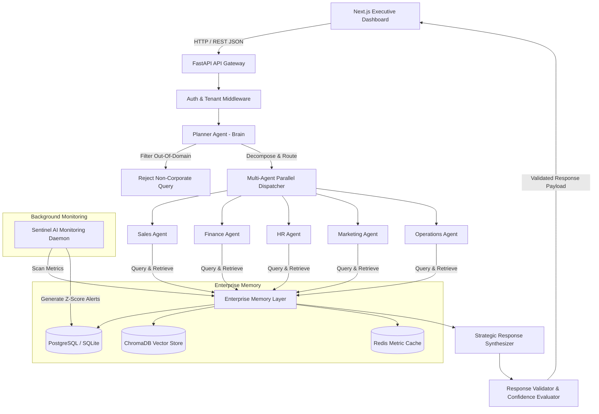

# Nexora AI — Master Project & Technical Documentation

---

## 1. Non-Technical & Executive Summary

### 1.1 Who We Are
We are the **Nexora AI Core Engineering and AI Research Team**. We design, build, and deploy enterprise-grade autonomous multi-agent intelligence systems that bridge raw corporate data with strategic executive decision-making.

### 1.2 What We Are Working On
We are building **Nexora AI** — an **Enterprise-Grade Autonomous AI Operating System**. 

Unlike standard consumer chatbot wrappers or generic document Q&A tools, Nexora AI operates as a coordinated, multi-agent executive leadership team. It ingests multi-departmental corporate data (Sales, Finance, HR, Marketing, Operations), constructs a structured **Enterprise Memory** layer, and delivers real-time executive reasoning, statistical anomaly detection, and cross-departmental correlation.

### 1.3 For Whom We Are Working (Target Audience & Personas)
Nexora AI is built specifically for modern mid-market and enterprise organizations:

* **Chief Executive Officers (CEOs)**: Require macro-level cross-departmental correlations, company-wide performance synthesis, and data-backed strategic resource allocation options.
* **Chief Financial Officers (CFOs)**: Require margin analysis, operational expense variance tracking, unit economics, revenue driver attribution, and financial forecasting.
* **Department VPs & Directors**: Require domain-specific deep dives (*Sales pipeline, HR attrition rate, Marketing CAC/ROAS, Operations SLA compliance*) and instant automated root-cause alerts.
* **Enterprise IT & DevOps Engineers**: Require strict SaaS tenant isolation, local data sovereignty (zero reliance on third-party cloud LLM APIs), and containerized deployments.

### 1.4 Core Philosophy & Working Principles
1. **Zero Hallucination Guarantee**: Every insight, metric, and recommendation produced by the platform must be directly traceable to underlying raw data points, SQL aggregation queries, or vector search evidence.
2. **Strict Multi-Agent Isolation**: Department agents operate independently using validated JSON schemas; direct inter-agent chatter is forbidden to guarantee complete auditability and prevent prompt injection propagation.
3. **Data Sovereignty & Local AI**: Built from the ground up to run on open-source stack components (FastAPI, SQLite/PostgreSQL, ChromaDB, Ollama local LLMs) with zero external API fees or data leakage risks.

---

## 2. Technology Stack & Infrastructure

| Layer | Component | Technology / Framework | Purpose |
| :--- | :--- | :--- | :--- |
| **Frontend UI** | Framework | **Next.js 14** (App Router, React 18, TypeScript) | High-performance executive interface |
| | Styling & Motion | **TailwindCSS v3**, **Framer Motion**, **Lucide Icons** | Obsidian dark-mode design (`#08080A`), glassmorphism, dynamic transitions |
| | Data Visualization | **Recharts** | Interactive financial & operational telemetry charts |
| **Backend API** | Framework | **Python 3.10+**, **FastAPI**, **Uvicorn** | High-throughput async REST API Gateway |
| | Data Processing | **Pandas**, **NumPy** | Data profiling, statistical computing, Z-Score math |
| | Validation & ORM | **Pydantic v2**, **SQLAlchemy ORM** | Schema validation, type safety, database interaction |
| **AI & ML Engine** | Local LLM Engine | **Ollama** (`qwen2.5:7b-instruct` / `llama3.2`) | On-premise local reasoning engine |
| | Embeddings | **SentenceTransformers** (`all-MiniLM-L6-v2`) | Local 384-dimensional vector embeddings |
| | Vector Store | **ChromaDB** | Semantic memory, metadata chunking, and similarity search |
| **Databases & Cache** | Relational DB | **SQLite** (Dev/Edge) / **PostgreSQL** (Production) | Multi-tenant relational storage, user metadata, audit logs |
| | Key-Value Cache | **Redis** | Query result caching, agent state, metric store |
| **DevOps & Containers** | Containerization | **Docker**, **Docker Compose** | Multi-container stack orchestration |
| | Testing | **Pytest** | Async API integration & unit test suite |

---

## 3. System Architecture & Data Workflow

### 3.1 High-Level Architecture Diagram



### 3.2 Detailed Step-by-Step Query Execution Workflow
1. **Request Ingestion**: The executive submits a natural language inquiry via the command bar or dashboard.
2. **Tenant Context Attachment**: The API Gateway extracts the user's JWT, verifies authorization, and scopes all operations to their `tenant_id`.
3. **Planner Intent Analysis**:
   - Checks query against the **Out-Of-Domain (OOD)** filter (rejecting non-business queries).
   - Identifies target departments required to answer the query.
4. **Parallel Agent Execution**:
   - The selected department agents (*e.g., Sales + Finance*) execute simultaneously.
   - Each agent queries the **Enterprise Memory Layer** using SQL aggregations and vector similarity.
   - Outputs are formatted strictly into Pydantic JSON contracts.
5. **Strategic Synthesis & Validation**:
   - The **Synthesizer** correlates cross-departmental evidence into an executive summary.
   - The **Validator** checks evidence citations and assigns a confidence score ($0-100\%$).
6. **Sentinel AI Background Daemon**:
   - Runs independently in the background.
   - Evaluates numeric metrics across uploaded datasets using Z-Score statistical outlier formulas:
     $$Z = \frac{|X - \mu|}{\sigma}$$
   - Generates tiered alerts (`LOW`, `MEDIUM`, `HIGH`, `CRITICAL`) and routes them to responsible executive roles.

---

## 4. Multi-Agent System Design

| Agent | Domain Responsibility | Key Metrics Monitored |
| :--- | :--- | :--- |
| **Planner Agent** | Orchestration, intent classification, OOD security, sub-task allocation | Target departments, query intent, multi-step execution plan |
| **Sales Agent** | Commercial revenue analysis, pipeline velocity, deal size | Total Revenue, Conversion Rate, Average Deal Size, CAC |
| **Finance Agent** | Financial health, OPEX, margins, cash flow, profitability | Net Profit Margin, Operating Expense, EBITDA, Cash Runway |
| **HR Agent** | Workforce analytics, talent retention, department payroll efficiency | Headcount Growth, Attrition Rate, Average Salary, Satisfaction Score |
| **Marketing Agent** | Acquisition efficiency, campaign performance, channel ROI | ROAS, Click-Through Rate (CTR), Customer Acquisition Cost, Leads |
| **Operations Agent** | Operational throughput, supply chain, delivery SLA, inventory | Order Lead Time, SLA Compliance %, Inventory Turnover, Defect Rate |
| **Sentinel AI** | Continuous background statistical anomaly detection | Z-Score Outliers ($Z > 2.0$), metric spikes/drops, root cause logs |
| **Response Validator** | Evidence verification, zero-hallucination guardrails | Citation check, Confidence Score ($0-100\%$), Factuality score |

---

## 5. Development Roadmap & Implementation Audit

The project was structured across **11 core development phases**. Below is the detailed audit of what has been **fully implemented** versus what remains for **future enterprise scaling**.

```
[ Phase 1 ] Foundation & Architecture Specs                ✅ 100% IMPLEMENTED
[ Phase 2 ] Authentication & SaaS Multi-Tenancy Engine     ✅ 100% IMPLEMENTED
[ Phase 3 ] Automated CSV Data Ingestion & Profiling       ✅ 100% IMPLEMENTED
[ Phase 4 ] Enterprise Memory Layer (SQL + ChromaDB)        ✅ 100% IMPLEMENTED
[ Phase 5 ] Planner Agent & Intent Understanding Engine     ✅ 100% IMPLEMENTED
[ Phase 6 ] 5 Department Agents & Response Synthesizer      ✅ 100% IMPLEMENTED
[ Phase 7 ] Strategic Agent & Response Validator            ✅ 100% IMPLEMENTED
[ Phase 8 ] Sentinel AI Continuous Monitoring Daemon        ✅ 100% IMPLEMENTED
[ Phase 9 ] Luxury Obsidian SaaS Dashboard UI               ✅ 100% IMPLEMENTED
[ Phase 10] High-Impact Landing Page & Animations           ✅ 100% IMPLEMENTED
[ Phase 11] Unit/Integration Pytest Suite & Containerization 🔄  90% IMPLEMENTED
```

### 5.1 Detailed Status Audit: What Has Been Implemented

#### ✅ Core Platform & Data Ingestion (Phases 1, 2, 3, 4)
* **JWT Multi-Tenant Auth**: Full tenant isolation (`tenant_id`), secure password hashing (Bcrypt), role-based tokens (`CEO`, `CFO`, `Director`, `Manager`, `Employee`).
* **Automated Data Profiler**: Automated ingestion of department CSVs with column data type detection, missing value profiling, baseline statistics, and automated row storage.
* **Enterprise Memory Manager**: Unified engine querying relational tables (SQLite/PostgreSQL) and ChromaDB vector collections with local 384-d embeddings (`all-MiniLM-L6-v2`).

#### ✅ Multi-Agent Reasoning Engine (Phases 5, 6, 7)
* **Planner & Out-of-Domain Filter**: Guards against non-corporate prompts, decomposes complex queries into department tasks.
* **5 Specialized Department Agents**: Fully implemented Sales, Finance, HR, Marketing, and Operations agents returning Pydantic schema structures.
* **Local Ollama Integration**: Native local LLM connectivity (`qwen2.5:7b-instruct` / `llama3.2`) with automatic fallback to statistical analytical heuristics if local LLM is offline.
* **Strategic Synthesizer & Validator**: Multi-department correlation engine with confidence scoring ($0-100\%$) and SQL query verification.

#### ✅ Sentinel AI Monitoring Daemon (Phase 8)
* **Z-Score Anomaly Engine**: Background daemon scanning numerical metrics across datasets for $Z > 2.0$ statistical deviations.
* **Tiered Executive Routing**: Automatic classification of anomalies (`LOW` $\rightarrow$ Employee, `MEDIUM` $\rightarrow$ Manager, `HIGH` $\rightarrow$ Director, `CRITICAL` $\rightarrow$ CEO).
* **Sentinel REST API**: Endpoints for listing alerts, triggering manual memory scans, and acknowledging alerts.

#### ✅ Executive Frontend Interface (Phases 9, 10)
* **Obsidian Executive Dashboard**: Next.js 14 dashboard with live tabs (*Overview*, *AI Query Engine*, *Data Ingestion*, *Sentinel Alerts*).
* **Interactive Query Console**: Real-time query execution, agent breakdown visuals, expandable SQL query inspection, and Recharts telemetry graphs.
* **Landing Page**: Landing page with Framer Motion animations, hero section, interactive feature highlights, and pricing tiers.

#### ✅ Deployment & Repository Setup (Phase 11 - 90%)
* **Git Repository**: Initialized, cleanly configured `.gitignore`, committed, and pushed to `https://github.com/vikram1306/nexora_ai.git`.
* **Docker Compose Stack**: Container configurations for FastAPI backend, Next.js frontend, and Ollama service.
* **Test Suite**: Automated Pytest backend integration test suite in `backend/tests/test_backend.py`.

---

### 5.2 What is Left to Implement according to Roadmap & Future Scale

While all 11 core functional phases are active and operational in the codebase, the following production enhancement items are scheduled for future milestone releases:

1. **Real-Time WebSocket Push Notifications for Sentinel AI**:
   * *Current State*: Sentinel alerts are fetched via REST API and manual/poll triggers.
   * *Planned Extension*: Implement FastAPI WebSockets (`/ws/sentinel`) to push `CRITICAL` alerts to the frontend in real time without browser polling.

2. **Automated Live Enterprise Data Connectors**:
   * *Current State*: Automated CSV data file upload pipeline.
   * *Planned Extension*: Direct database connectors for live streaming sources (PostgreSQL CDC, Snowflake, BigQuery, Salesforce API, HubSpot API).

3. **Enterprise SSO & SAML 2.0 / OAuth2 Integration**:
   * *Current State*: Email/Password registration with JWT tokens.
   * *Planned Extension*: Single Sign-On integration for Okta, Azure Active Directory, and Google Workspace.

4. **Production Kubernetes & CI/CD Pipelines**:
   * *Current State*: Local Docker Compose stack and local Pytest execution.
   * *Planned Extension*: GitHub Actions CI/CD workflows for automated build testing, along with Kubernetes Helm charts for auto-scaling cluster deployments.

5. **Fine-Tuned Domain LLM Weights**:
   * *Current State*: Zero-shot prompting with standard Ollama weights (`qwen2.5:7b-instruct`).
   * *Planned Extension*: LoRA fine-tuning on corporate SEC filings and financial reporting standards.

---

## 6. How to Run the Platform

### 6.1 Backend (FastAPI & Python)
```bash
# Create and activate virtual environment
python -m venv venv
venv\Scripts\activate  # Windows

# Install dependencies
pip install -r backend/requirements.txt

# Run backend API server
uvicorn backend.app.main:app --reload --port 8000
```

### 6.2 Frontend (Next.js 14)
```bash
# Navigate to frontend directory
cd frontend

# Install dependencies
npm install

# Run frontend development server
npm run dev
```

### 6.3 Full Stack with Docker Compose
```bash
docker-compose up --build
```
